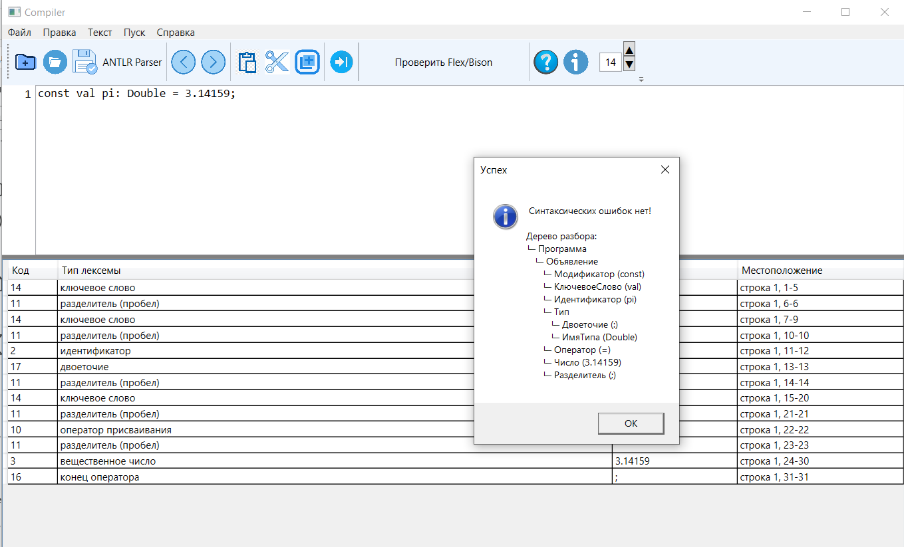

Цель работы: Изучить назначение и принципы работы синтаксического анализатора в структуре компилятора.
Спроектировать грамматику, построить схему метода анализа, выполнить программную реализацию парсера с нейтрализацией синтаксических ошибок методом Айронса и интегрировать разработанный модуль в графический интерфейс языкового процессора.

Работа выполнена студентом Гидульяновым Кириллом Сергеевичем, группа АВТ‑313.

Постановка задачи: Необходимо разработать синтаксический анализатор (парсер) в соответствии с индивидуальным вариантом курсовой работы, интегрировать его в приложение из лабораторной работы №1 и обеспечить наглядный вывод результатов анализа.

Вариант задания
Вариант №54. Объявление вещественной константы с инициализацией на языке Kotlin.

В связи с разработанной автоматной грамматикой G[<Z>] синтаксический анализатор (парсер) создания функции будет считать верными следующие записи функций:
1)	“const val pi: Double = 3.14159;”
2)	“const val x:Double = -12.0;”
3)	“const val radius_2:Double = 10;”

Перечень допустимых лексем:

Ключевые слова: const, val, Double
Идентификаторы: буквы, цифры, _, начинаются с буквы
Оператор присваивания: =
Служебные символы: :, ;
Числовые литералы:
Целые (10, 42)
Вещественные (3.14, 0.001)
Допускается унарный минус (-5, -2.7)
Пробелы
Ошибочные символы (например: &, @, $)

Классификация грамматики по Хомскому:
Грамматика Контекстно-свободной, так каждое правило принимает вид: A->a
где:
A — один нетерминал
α — любая последовательность терминалов и/или нетерминалов

Разработка грамматики (полное определение разработанной грамматики).
grammar KotlinConst;

program
    : declaration* EOF
    ;

declaration
    : CONST VAL IDENT COLON DOUBLE ASSIGN number SEMICOLON
    ;

number
    : MINUS? (INT | REAL)
    ;

CONST      : 'const';
VAL        : 'val';
DOUBLE     : 'Double';
COLON      : ':';
ASSIGN     : '=';
SEMICOLON  : ';';
MINUS      : '-';

IDENT      : [a-zA-Z_] [a-zA-Z0-9_]*;
INT        : [0-9]+;
REAL       : [0-9]+ '.' [0-9]+;

WS         : [ \t\r\n]+ -> skip;

ERROR_CHAR : . ;

Метод анализа
В работе используется:

Метод рекурсивного спуска
Каждое правило грамматики реализовано отдельной функцией (ParseDeclaration, ParseType, ParseExpression, …).
Анализ выполняется слева направо, с одним токеном look‑ahead.

Нейтрализация ошибок — метод Айронса
при обнаружении ошибки включается panicMode;

выполняется SkipTo(';');

после нахождения ; парсер восстанавливается и продолжает анализ следующего оператора.

Диагностика и нейтрализация синтаксических ошибок
Реализовано:

определение позиции ошибки (строка, столбец);

вывод сообщения об ошибке;

подсветка ошибочного токена в интерфейсе;

восстановление после ошибки методом Айронса;

возможность выдачи нескольких ошибок в одном объявлении (например, отсутствие : и отсутствие ;).

Тестовые примеры: 
1. const val pi: Double = 3.14159;
Результат:
ошибок нет
построено корректное AST
ANTLR‑парсер также подтверждает корректность

2.const val pi: Double = 3.14159
ошибка: «Ожидается ';'»

