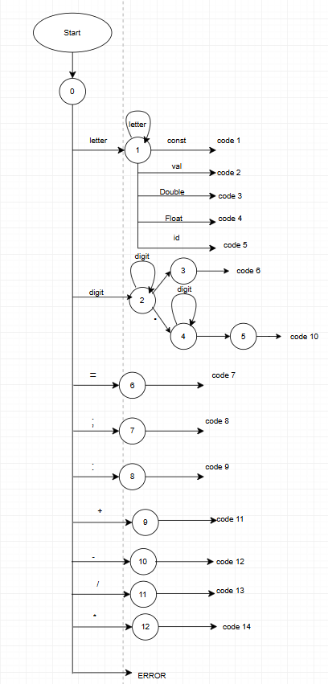

Компилятор — Лексический и синтаксический анализатор мини-языка объявлений переменных

───────────────────────────────────────────────────────────────
Название и цель лабораторной работы
───────────────────────────────────────────────────────────────

Название: Лабораторная работа №2. Разработка лексического и синтаксического анализатора  
Цель: Создать мини-язык объявлений переменных, разработать лексический анализатор, синтаксический анализатор, построить дерево разбора и интегрировать анализатор в WPF‑редактор.

───────────────────────────────────────────────────────────────
Сведения об авторе
───────────────────────────────────────────────────────────────

Автор: Гидульянов Кирилл Сергеевич  
Группа: АВТ‑313  
Вариант: №54  

───────────────────────────────────────────────────────────────
Постановка задачи
───────────────────────────────────────────────────────────────

Необходимо разработать:

• конечный автомат для лексического анализа  
• таблицу лексем  
• синтаксическую грамматику  
• Flex/Bison‑парсер  
• C#‑парсер с построением AST  
• тестовые примеры  
• README‑документацию  

Мини-язык должен поддерживать объявление вещественной константы с инициализацией, аналогичное синтаксису Kotlin.

───────────────────────────────────────────────────────────────
Вариант задания
───────────────────────────────────────────────────────────────

Тема варианта: «Объявление вещественной константы с инициализацией на языке Kotlin»

Пример в Kotlin:

    const val PI: Double = 3.1415

Упрощённый синтаксис, реализованный в проекте:

    [const] val <идентификатор> [: <тип>] = <вещественное выражение> ;

Примеры корректных входных строк:

    val x = 3.14;
    const val PI: Double = 3.1415;
    val r: Float = 2.5 * 4.0;

Допустимые лексемы:

• ключевые слова: val, const, Double, Float  
• идентификаторы  
• числа: целые и вещественные  
• операторы: =, *, /  
• служебные символы: :, ;  
• пробелы  
• ошибки  

───────────────────────────────────────────────────────────────
Диаграмма состояний (FSM)
───────────────────────────────────────────────────────────────

Файл диаграммы: Lab2COMP.png

Описание работы автомата:

• состояния для идентификаторов  
• состояния для целых чисел  
• состояния для вещественных чисел (с точкой)  
• циклические переходы по цифрам  
• переходы по операторам `*` и `/`  
• состояние ошибки при недопустимом символе  

───────────────────────────────────────────────────────────────
Грамматика (разработанная вручную)
───────────────────────────────────────────────────────────────

    Программа → { Объявление }

    Объявление → [Const] Val Идентификатор [Тип] '=' Выражение ';'

    Тип → ':' (Double | Float)

    Выражение → Фактор { ('*' | '/') Фактор }

    Фактор → Число | Идентификатор

───────────────────────────────────────────────────────────────
Грамматика для Flex/Bison
───────────────────────────────────────────────────────────────

    program:
          declaration
        ;

    declaration:
          optional_const VAL IDENTIFIER optional_type ASSIGN expression SEMICOLON
        ;

    optional_const:
          /* empty */
        | CONST
        ;

    optional_type:
          /* empty */
        | COLON type
        ;

    type:
          DOUBLE
        | FLOAT
        ;

    expression:
          term
        | expression '*' term
        | expression '/' term
        ;

    term:
          factor
        ;

    factor:
          REAL_NUMBER
        | IDENTIFIER
        ;

───────────────────────────────────────────────────────────────
Классификация грамматики
───────────────────────────────────────────────────────────────

• Тип грамматики: контекстно‑свободная (КС‑грамматика)  
• Класс по Хомскому: тип 2  
• Детерминированность: да  
• Левой рекурсии нет  
• Подходит для нисходящего разбора  

───────────────────────────────────────────────────────────────
Примеры допустимых строк
───────────────────────────────────────────────────────────────

    val x = 3.14;
    val y = 10 / 5;
    val r = 2.5 * 4.0;
    const val k: Double = 2.0 / 3.0;
    val z = 3.14 * 2 / 5;

───────────────────────────────────────────────────────────────
Тестовые примеры
───────────────────────────────────────────────────────────────

Корректная строка:

| Вход | Лексемы |
|------|---------|
| `val x = 3.14 * 2;` | val, идентификатор, =, число, *, число, ; |

Строка с недопустимым символом:

| Вход | Ошибка |
|------|--------|
| `val x = 3.14 * 2$;` | ошибка: недопустимый символ `$` |

Многострочный пример:

| Вход | Результат |
|------|-----------|
| `val x = 3.14;` `val y = x * 2;` | корректно |

───────────────────────────────────────────────────────────────
Пример дерева разбора (AST)
───────────────────────────────────────────────────────────────

Для строки:

    val x = 3.14 * 2;

Дерево:

    └─ Объявление
       └─ КлючевоеСлово (val)
       └─ Идентификатор (x)
       └─ Оператор (=)
       └─ Операция
          └─ Число (3.14)
          └─ Оператор (*)
          └─ Число (2)
       └─ Разделитель (;)

───────────────────────────────────────────────────────────────
Сборка автономного EXE
───────────────────────────────────────────────────────────────

Команда:

    dotnet publish -c Release -r win-x64 --self-contained true ^
        /p:PublishSingleFile=true ^
        /p:IncludeAllContentForSelfExtract=true

Готовый EXE находится в:

    bin/Release/net7.0-windows/win-x64/publish/

───────────────────────────────────────────────────────────────
Структура проекта
───────────────────────────────────────────────────────────────

    LC1/
     ├─ Parser.cs
     ├─ MainWindow.xaml.cs
     ├─ lexer (встроен в C#)
     ├─ parser.exe (Flex/Bison)
     ├─ Lab2COMP.png (диаграмма)
     ├─ README.md
     └─ publish/

───────────────────────────────────────────────────────────────
Вывод
───────────────────────────────────────────────────────────────

Разработан мини‑язык объявлений переменных, лексический и синтаксический анализаторы, дерево разбора, WPF‑редактор и автономный EXE.  
Работа полностью соответствует требованиям лабораторной.
